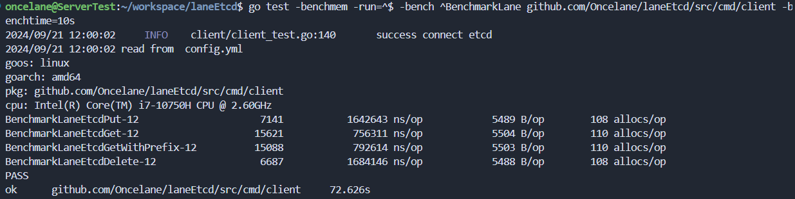
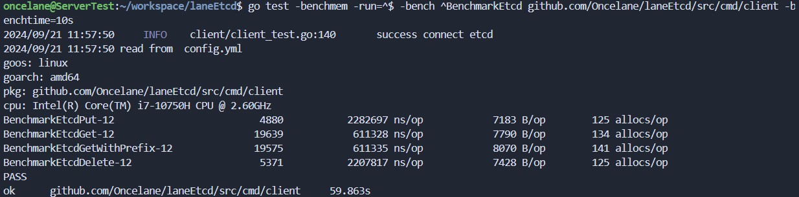
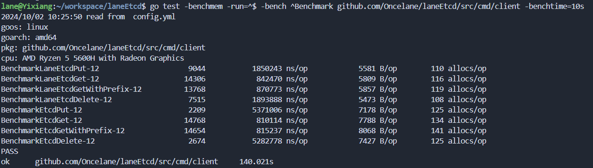

# laneETCD

脱离 mit6.5840（前 mit6.840）实现而来，实现 raft 强一致性分布式共识算法，使用 kv 键值对外提供强一致的服务注册等服务

已实现：

- 集群部署
- snapshot 持久化，崩溃恢复
- readIndex，读请求不需要记录日志
- 压缩前缀树存储
- 支持前缀范围查询
- TTL-key：键值对支持过期时间
- MetaTags：支持元标签，可用于扩展版本控制，流量染色，负载均衡
- pipeline：可使用类似 redis 的 pipeline 进行批量操作了
- CAS api：可使用 CAS 语义进行 Set 操作了；未来计划封装成 SetEX，SetNX 等接口；
- Lock api：分布式锁，可以直接调用客户端提供的 api 直接使用分布式锁了；未来计划还将实现 watchDog 租约机制；
- CPU 占用率优化，将算法中的一些轮询机制改为通知机制

暂未实现：

- 动态集群
- 租约机制，从节点读
- 心跳保活机制，及时发现失联服务
- duplicateMap 内存占用问题，即 clientId 租期机制
- 定时扫描删除过期 TTL

性能：

```sh
#压测命令
go test -benchmem -run=^$ -bench ^Benchmark github.com/Oncelane/laneEtcd/src/cmd/client -benchtime=10s
```

压测环境一:
CPU: i7-10750H CPU @ 2.60GHz

| 压测项目      | laneEtcd   | Etcd       | 耗时与 Etcd 相比 |
| ------------- | ---------- | ---------- | ---------------- |
| Get           | 0.76 ms/op | 0.61 ms/op | +24.5%           |
| GetWithPrefix | 0.79 ms/op | 0.61 ms/op | +29.5%           |
| Put           | 1.64 ms/op | 2.28 ms/op | -28.1%           |
| Delete        | 1.68 ms/op | 2.20 ms/op | -23.6%           |

压测环境二:
CPU: AMD Ryzen 5 5600H with Radeon Graphics

| 压测项目      | laneEtcd   | Etcd       | 耗时与 Etcd 相比 |
| ------------- | ---------- | ---------- | ---------------- |
| Get           | 0.84 ms/op | 0.81 ms/op | +3.7%            |
| GetWithPrefix | 0.87 ms/op | 0.81 ms/op | +7.4%            |
| Put           | 1.85 ms/op | 5.37 ms/op | -65.5%           |
| Delete        | 1.89 ms/op | 5.28 ms/op | -64.2%           |

从压测数据可以看到 laneEtcd 读写性能均与 Etcd 较为持平，在写性能上略胜一筹

尤其是在较低配置的笔记本上，Etcd 性能下降非常明显，而 laneEtcd 性能只有小小的下降。

> 此压测性能仅作当前阶段参考，并不意味着本项目性能真的超越 Etcd
>
> etcd 3.0 为了支持事务，保存的数据有版本号，可以指定版本读取历史数据（如果不压缩清除历史版本的数据），如果不指定，默认读取最大版本的数据，且因为需要保存的数据量增加，从内存存储改成了磁盘存储，使用了 BoltDB 数据库
>
> 而本项目仍然使用内存存储且只通过 CAS 支持简单的事务。

# 测试截图

laneEtcd



Etcd



配置较低的笔记本上的压测源数据：



> laneEtcd 的性能变化不大，但是 Etcd 的性能相比在另一台高配一点的笔记本上的数据就有些奇怪，推测是主动限制了 cpu 占用率
> 但是使用 htop 命令的时候，laneEtcd 和 Etcd 两者的 cpu 占用率差距很小，12 核均在 20~30%波动，因此暂时将此数据中 Etcd 的部分搁置，降低参考意义。

# 运行服务端

## 编译

```sh
git clone https://github.com/Oncelane/laneEtcd.git
cd laneEtcd
make build
```

## 查看启动配置文件

```yml
# 根目录下的config中自带三个成员的配置文件 config.yml,表示每个实例的启动设置，标识为unique的条目不能在集群成员配置中重复
addr: 127.0.0.1
port: :51240 # unique 客户端与服务端通讯的grpc端口号
rafts:
  me: 0 # unique 有多少个
  endpoints: # 服务端之间沟通使用的grpc端口号
    - addr: 127.0.0.1
      port: :32300
    - addr: 127.0.0.1
      port: :32301
    - addr: 127.0.0.1
      port: :32302
databasepath: "data0" # unique
maxraftstate: 100000 # snapshoot时机，当log数目达到此数目时进行快照，释放内存
```

## 运行服务端

```sh
make run
```

## 客户端使用请参考 src/cmd/client/client_test.go

## 防呆 proto 指令

protoc --go_out=.. --go-grpc_out=.. --go-grpc_opt=require_unimplemented_servers=false -I. -Iproto proto/pb/pb.proto
